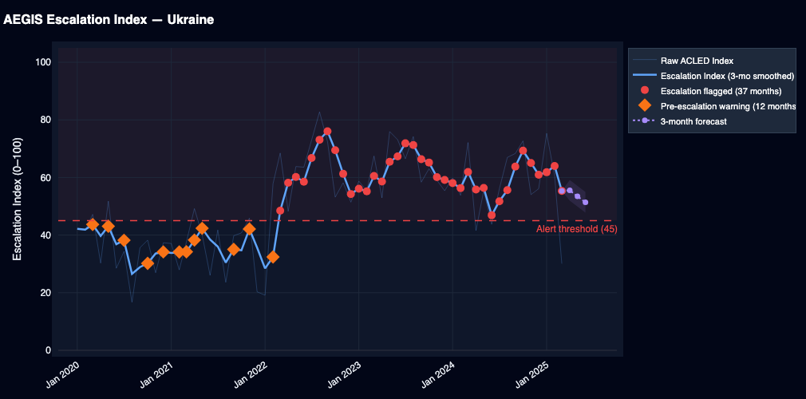
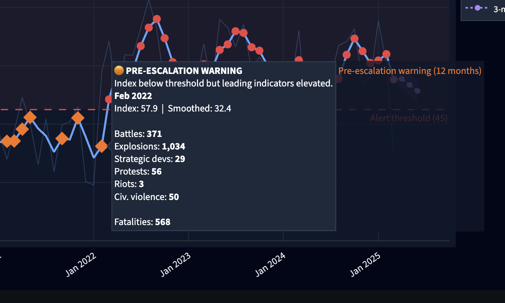

# AEGIS — Escalation Detection Demo
**Advanced Early-Warning & Geostrategic Intelligence System**
🔗 [aegis-intel.streamlit.app](https://aegis-intel.streamlit.app/)

---

## Overview

AEGIS is an open-source geopolitical intelligence platform that detects and visualizes conflict escalation in near real-time. It combines a structured escalation scoring framework with live ACLED conflict data to produce decision-ready risk assessments for any country in the world.

The system is designed to surface what public discourse misses: the measurable precursor signals that precede conflict escalation — increases in explosion rates, civilian targeting, strategic actor movements, and civil unrest — weeks or months before events become headline news.

---

## What It Does

**Escalation Index**
Enter any country and AEGIS computes a composite escalation score (0–100) across six weighted sub-indicators, smoothed over time and plotted as a monthly time series. The index flags escalation events, pre-escalation warning periods, and projects a 3-month forward trend using linear regression on recent signal momentum.

| Sub-Indicator | Weight |
|---|---|
| Raw conflict intensity | 30% |
| Event frequency acceleration | 20% |
| Explosions / remote violence | 20% |
| Strategic developments | 15% |
| Civil unrest | 10% |
| Civilian targeting ratio | 5% |

## Example Output:

## Pre-Escalation Prediction flagged Russian Invasion of Ukraine Before The Attack.

**Interactive Global Conflict Map**
A live conflict map powered by the ACLED public ArcGIS layer, updated monthly. Available in two modes:

- **2D Map** — Dark tile map with color-coded conflict bubbles by category. Click any region to zoom and see country-level breakdowns. Powered by Leaflet.js.
- **3D Globe** — Rotating WebGL globe with country borders, geographic labels, and conflict dots. Click anywhere on a country to fly to it and open its data panel. Powered by Three.js.

Both maps show: Battles, Explosions/Remote Violence, Violence Against Civilians, Strategic Developments, Protests, and Riots — colored and sized by conflict intensity.

---

## Data Sources

| Source | Used For |
|---|---|
| ACLED Researcher-Tier API | Escalation Index (full history, per-country event data) |
| ACLED Public ArcGIS Layer | Interactive map (monthly subnational aggregates, ~4–6 week lag) |
| Google News RSS | Live conflict news feed per country |

---

## Intended Users

- Policy researchers and think tanks
- National security and intelligence analysts
- Congressional and parliamentary staff
- Risk assessment and due diligence teams
- NGOs operating in fragile or conflict-affected states
- Journalists covering geopolitical risk

---

## Limitations

- Map data is monthly-aggregated and typically 4–6 weeks behind the current date.
- The Escalation Index is a quantitative signal tool, not a predictive model. It reflects measured conflict patterns, not intent or political context.
- ACLED coverage varies by country and time period. Sparse data in earlier months or less-covered regions may affect index reliability.
- The 3-month forecast is a linear trend projection and should be interpreted with caution.
- AEGIS does not factor in diplomatic communications, classified intelligence, or qualitative political analysis.

---

## Tech Stack

- **Frontend / App**: Streamlit
- **Escalation Index**: Python (Pandas, NumPy, Matplotlib)
- **2D Map**: Leaflet.js via `st.components.v1.html`
- **3D Globe**: Three.js + TopoJSON via `st.components.v1.html`
- **Data**: ACLED REST API + ArcGIS FeatureServer, Google RSS via feedparser
- **Hosting**: Streamlit Community Cloud
